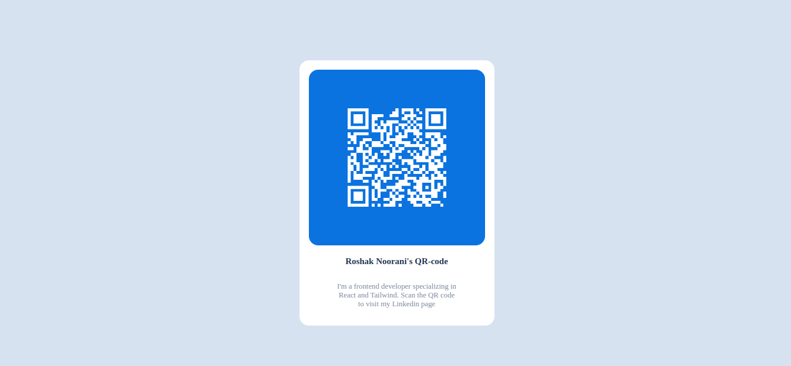

# Frontend Mentor - QR code component solution

This is a solution to the [QR code component challenge on Frontend Mentor](https://www.frontendmentor.io/challenges/qr-code-component-iux_sIO_H).

> I changed the QR code to forward to my Linkedin page. The styling for the QR code has also changed for better performance.

## Table of contents

- [Overview](#overview)
  - [Screenshot](#screenshot)
  - [Links](#links)
  - [Built with](#built-with)
- [Author](#author)

## Overview

### Screenshot

### Links

- Solution URL: [Github](https://github.com/RoshakN/qrcode-fm/)
- Live Site URL: [Github Pages](https://roshakn.github.io/qrcode-fm/)

### Built with

- CSS custom properties
- Flexbox
- Mobile-first workflow

## Author

- Linkedin - [Roshak Noorani](https://www.linkedin.com/in/roshaknoorani/)
- Frontend Mentor - [@RoshakN](https://www.frontendmentor.io/profile/RoshakN)
- Twitter - [roshak.eth](https://www.twitter.com/RoshakNoorani)
